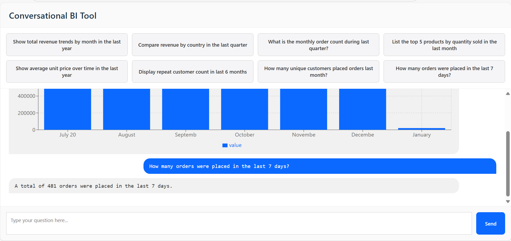

# Conversational BI UI

This is the frontend React application for the Conversational BI tool. It connects to a backend API and displays chat-based insights and dynamic charts.

## 🚀 Features

- React-based UI
- Streaming Server-Sent Events (SSE) for real-time responses
- Bar chart rendering with Recharts
- Dockerized development setup

---

## 🛠 Project Setup

### 1. Clone the repository

```bash
git clone https://github.com/haroonob/your-ui-repo.git
cd react-ui-for-bi
npm install
npm run dev




